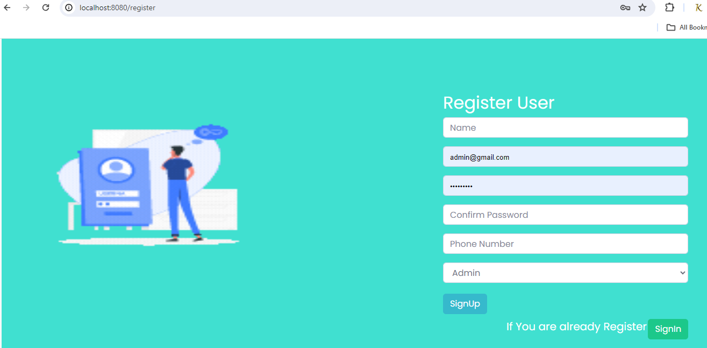
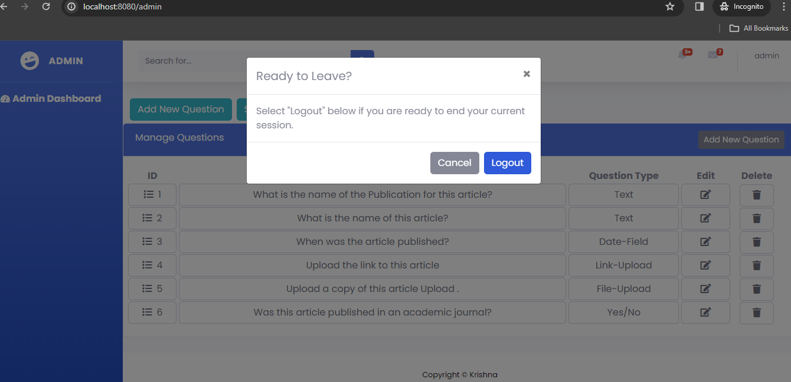
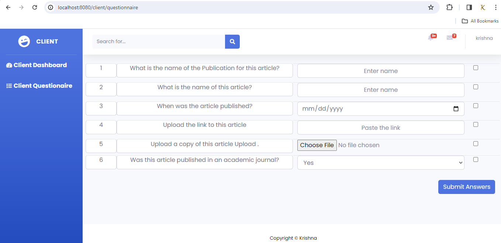
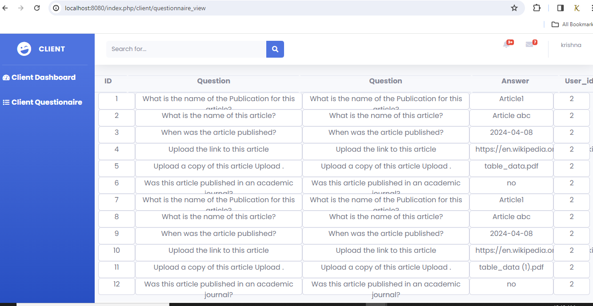
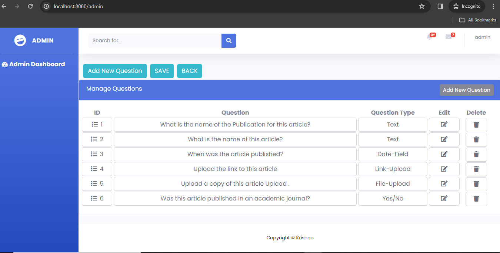
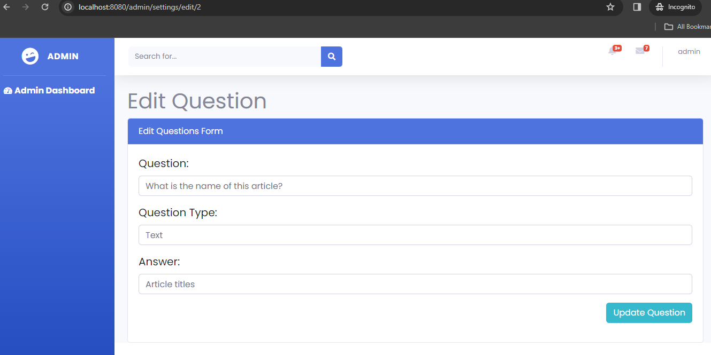
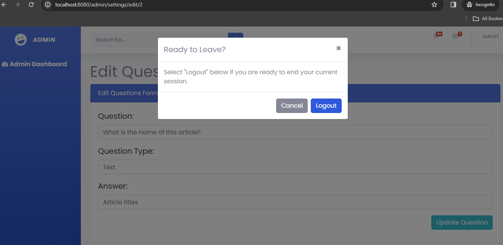
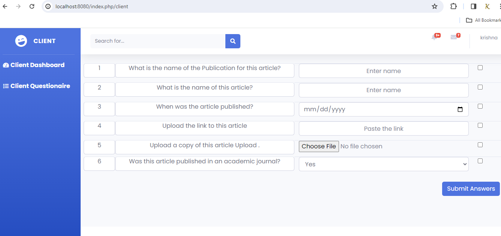
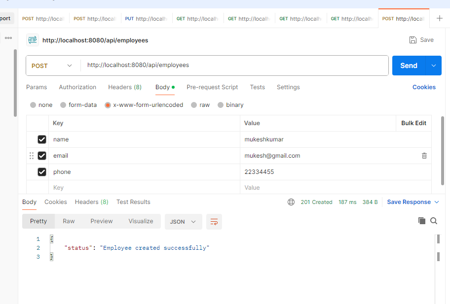
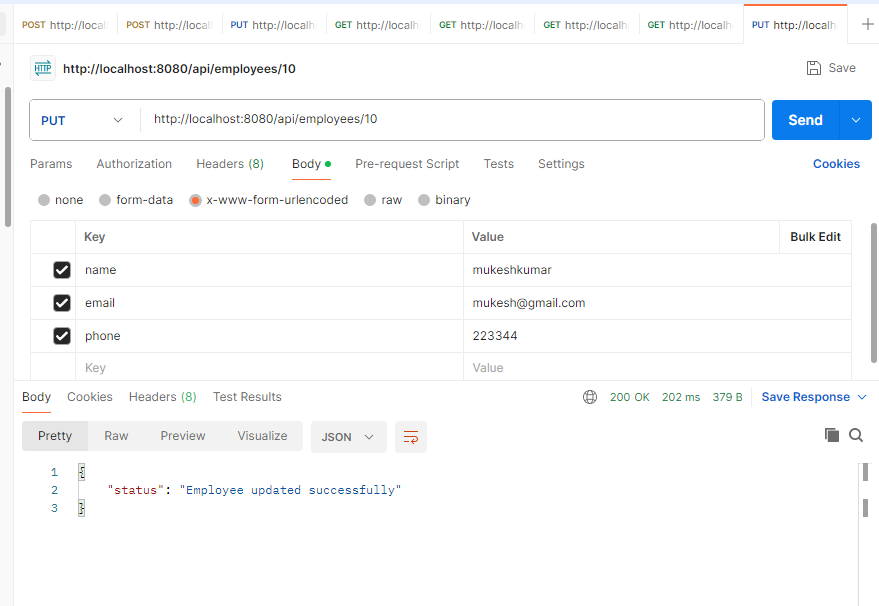

# CodeIgniter 4 Application Starter

## What is CodeIgniter?

CodeIgniter is a PHP full-stack web framework that is light, fast, flexible and secure.
More information can be found at the [official site](https://codeigniter.com).

This repository holds a composer-installable app starter.
It has been built from the
[development repository](https://github.com/codeigniter4/CodeIgniter4).

More information about the plans for version 4 can be found in [CodeIgniter 4](https://forum.codeigniter.com/forumdisplay.php?fid=28) on the forums.

You can read the [user guide](https://codeigniter.com/user_guide/)
corresponding to the latest version of the framework.

## Installation & updates

`composer create-project codeigniter4/appstarter` then `composer update` whenever
there is a new release of the framework.

When updating, check the release notes to see if there are any changes you might need to apply
to your `app` folder. The affected files can be copied or merged from
`vendor/codeigniter4/framework/app`.

## Setup

Copy `env` to `.env` and tailor for your app, specifically the baseURL
and any database settings.

## Important Change with index.php

`index.php` is no longer in the root of the project! It has been moved inside the *public* folder,
for better security and separation of components.

This means that you should configure your web server to "point" to your project's *public* folder, and
not to the project root. A better practice would be to configure a virtual host to point there. A poor practice would be to point your web server to the project root and expect to enter *public/...*, as the rest of your logic and the
framework are exposed.

**Please** read the user guide for a better explanation of how CI4 works!

## Repository Management

We use GitHub issues, in our main repository, to track **BUGS** and to track approved **DEVELOPMENT** work packages.
We use our [forum](http://forum.codeigniter.com) to provide SUPPORT and to discuss
FEATURE REQUESTS.

This repository is a "distribution" one, built by our release preparation script.
Problems with it can be raised on our forum, or as issues in the main repository.

## Server Requirements

PHP version 7.4 or higher is required, with the following extensions installed:

- [intl](http://php.net/manual/en/intl.requirements.php)
- [mbstring](http://php.net/manual/en/mbstring.installation.php)

> [!WARNING]
> The end of life date for PHP 7.4 was November 28, 2022.
> The end of life date for PHP 8.0 was November 26, 2023.
> If you are still using PHP 7.4 or 8.0, you should upgrade immediately.
> The end of life date for PHP 8.1 will be November 25, 2024.

Additionally, make sure that the following extensions are enabled in your PHP:

- json (enabled by default - don't turn it off)
- [mysqlnd](http://php.net/manual/en/mysqlnd.install.php) if you plan to use MySQL
- [libcurl](http://php.net/manual/en/curl.requirements.php) if you plan to use the HTTP\CURLRequest library


**Steps to be Follow**

**downlaod the repository paste into the xampp/htdocs/ folder**
**1. Update Composer**

```
Composer update

```

**2. Update Environment Configuration
Go to the .env file and change the CI_ENVIRONMENT variable to development.**

```
CI_ENVIRONMENT = development
```

**3. Set Database Credentials
Go to app\Config\Database.php and add your database credentials:**
```
public array $default = [
        'DSN'          => '',
        'hostname'     => 'localhost',
        'username'     => 'root',
        'password'     => 'Yourpassword',
        'database'     => 'Your_DatabaseName',
        'DBDriver'     => 'MySQLi',
        'DBPrefix'     => '',
        'pConnect'     => false,
        'DBDebug'      => true,
        'charset'      => 'utf8',
        'DBCollat'     => 'utf8_general_ci',
        'swapPre'      => '',
        'encrypt'      => false,
        'compress'     => false,
        'strictOn'     => false,
        'failover'     => [],
        'port'         => 3306,
        'numberNative' => false,
    ];

```
**4. Migrate the Database Tables Go Sql/ci4.sql file
Import the database tables into you Database**

**5. Run the Application
To start the application, run the following command:**
```
php spark serve

```
*This will start the development server, and you can access your application at http://localhost:8080**

**Application Features:**

Developed an admin interface for managing Questionaire data, including:

Authentication:

● Implement user authentication using PHP sessions or tokens.

● Store user credentials securely in a database with hashed passwords.

Authorization:

● Created a system to manage user roles and permissions (Admin and Client).
● Defined access levels for different parts of the application based on user roles.
● Implemented role-based access control (RBAC) to enforce these permissions.
**Admin Interface**




**Client Interface**


Answer Submitted by Client stored displayed in the dasboard based on User_id.


User Management:
1. In Admin Login,
Create a setting page to add, edit, delete, and sort the Questions with the Answer Field
Type.




2. Create a new Questionnaire page on the Client Login side to list all the questions with
answer fields according to the setting. And store the client.



**Crud Rest api**
delete api
Delete:http://localhost:8080/api/employee/create


single record url:
get: http://localhost:8080/api/employees/3


To fetch all the Employee Records:
Get:http://localhost:8080/api/employees


To Insert New Record:
Post:http://localhost:8080/api/employees


To update Existing Record:
Put:http://localhost:8080/api/employees/10



